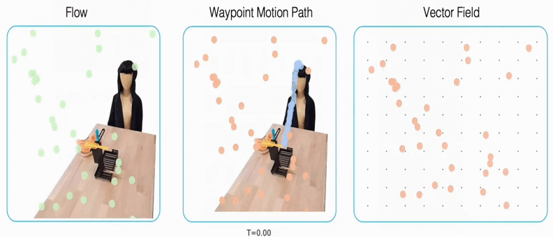

# 🤖🌊 robot manipulation with flow matching

A reference implementation for the `Affordance-based Robot Manipulation with Flow Matching`.

* Paper page: Affordance-based Robot Manipulation with Flow Matching. https://arxiv.org/abs/2409.01083
* Project page: https://hri-eu.github.io/flow-matching-policy/
* Code: https://github.com/HRI-EU/flow_matching
* Author: Fan Zhang (fan.zhang@honda-ri.de), Michael Gienger
<!--* <video src="https://github.com/user-attachments/assets/633d6756-a3ff-4fde-aace-bbf5fbd58866" width="300" autoplay loop muted>-->

## Key components
🔬 **This repo contains** \
Training and evaluation examples of using flow matching on PushT and Franka Kitchen benchmarks.

🌷 **Getting Started**
1. Clone this repo and change into it: `git clone git@github.com:HRI-EU/flow-matching-policy.git && cd flow_matching` \
2. Install the Python dependencies: `python -m venv venv_fm && source venv_fm/bin/activate && pip install --no-cache-dir -r requirements.txt`
3. Enjoy!

<!--* Tulip variations with access to a tool library
  * `MinimalTulipAgent`: Minimal implementation; searches for tools based on the user input directly
  * `NaiveTulipAgent`: Naive implementation; searches for tools with a separate tool call
  * `CotTulipAgent`: COT implementation; derives a plan for the necessary steps and searches for suitable tools
  * `InformedCotTulipAgent`: Same as `CotTulipAgent`, but with a brief description of the tool library's contents
  * `PrimedCotTulipAgent`: Same as `CotTulipAgent`, but primed with tool names based on an initial search with the user request
  * `OneShotCotTulipAgent`: Same as `CotTulipAgent`, but the system prompt included a brief example
  * `AutoTulipAgent`: Fully autonomous variant; can use the search tool at any time and modify its tool library with CRUD operations
  * `DfsTulipAgent`: DFS inspired variant that leverages a DAG for keeping track of tasks and suitable tools, can create new tools-->
  
🏆 **Some Results** \
Pretrained weights with flow matching: [Push-T](https://drive.google.com/file/d/1czhtJyD3ny8op-P626Ucqhqur8SIaZZs/view?usp=sharing), [Franka Kitchen](https://drive.google.com/file/d/1oZioEezMlN-7Psu2UQBvLx_YztR7YkG8/view?usp=sharing), [Robomimic](https://drive.google.com/file/d/1JftyoYIdNtIhcuC3nvIKfAvEwj9Wv6T1/view?usp=sharing)

| Methods       | Push-T1 | Push-T2       | Franka Kitchen | Robomimic3 |
| ------------- | ------------- | ------------- | ------------- | ------------- |
| Flow Matching | 0.9035/0.7519 | 0.7363/0.6218 | 0.9960/0.7425 | 0.9360/0.7289 |

sampling range1: [rs.randint(50, 450), rs.randint(50, 450), rs.randint(200, 300), rs.randint(200, 300), rs.randn() * 2 * np.pi - np.pi]

sampling range2: [rs.randint(50, 450), rs.randint(50, 450), rs.randint(100, 400), rs.randint(100, 400), rs.randn() * 2 * np.pi - np.pi]

Robomimic3: transport task ph

📝 **Acknowledgements** 
* The model structure implementation is modified from Cheng Chi's [diffusion_policy](https://github.com/real-stanford/diffusion_policy) repo. The code is under external/diffusion_policy (MIT license). Some code that we modified is located under external/models.
* We use some functions from Alexander Tong's [TorchCFM](https://github.com/atong01/conditional-flow-matching) repo (MIT license). It is installed through pip.
* Please download the PushT and robomimic demonstration data from Cheng Chi's 
[diffusion_policy](https://github.com/real-stanford/diffusion_policy) repo. 
* Please download the Franka Kitchen demonstration data from Nur Muhammad Shafiullah's 
[Behavior Transformers](https://mahis.life/bet/) repo (MIT license).

## License

This project is licensed under the BSD 3-clause license - see the [LICENSE.md](LICENSE.md) file for details
